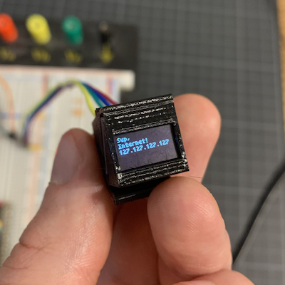
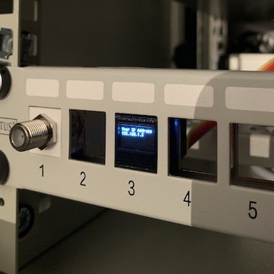

# Keystone OLED

A keystone adapter for a tiny OLED display.

 

## ⚠️ DISCLAIMER ⚠️

The adapter is slightly outside the keystone spec. This is due to the size of the OLED display module being slightly larger than the width of most keystone jacks.

I have tried it with a few keystone panels and haven't had any issues other than it being quite a snug fit, but I guess it's possible it won't fit in your panel - sorry!

## Where do I obtain this display meant for ants?

I bought mine from [AliExpress](https://www.aliexpress.com/i/33047471191.html).

You find plenty others with the following keywords: "64x32 SSD1306 0,49 inc OLED"

## But why?

Some rack enclosures for devices like RPIs come with keystone holes meant to bring connectivity from the back of a device to the front of the enclosure - I figured it would be nice to use this space for status updates.

## Acknowledgements

* [SolveSpace](https://solvespace.com/) ❤️
* [Tom Thumb](https://robey.lag.net/2010/01/23/tiny-monospace-font.html)
* [Adafruit_CircuitPython_SSD1306](https://github.com/adafruit/Adafruit_CircuitPython_SSD1306)

Thanks!
